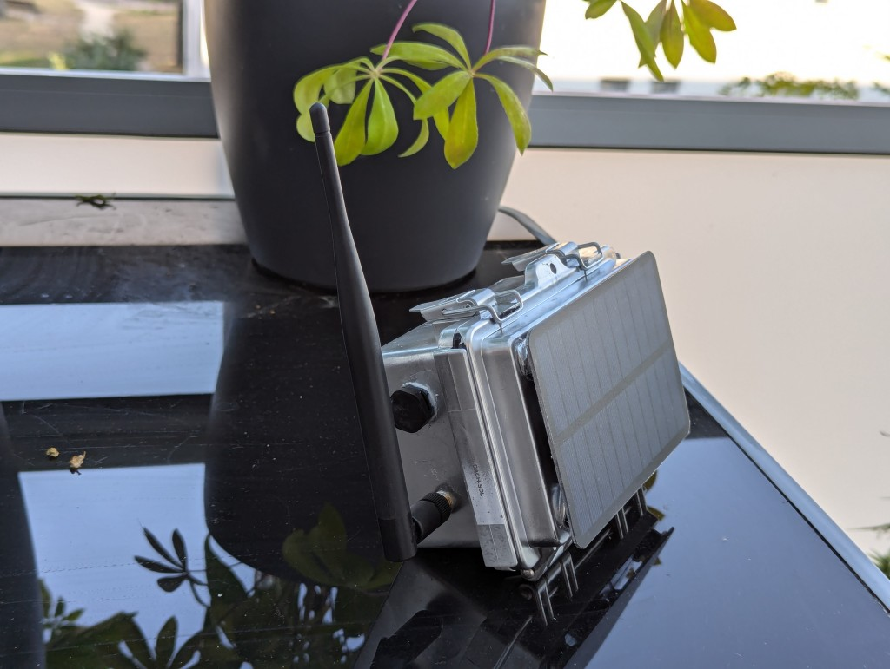
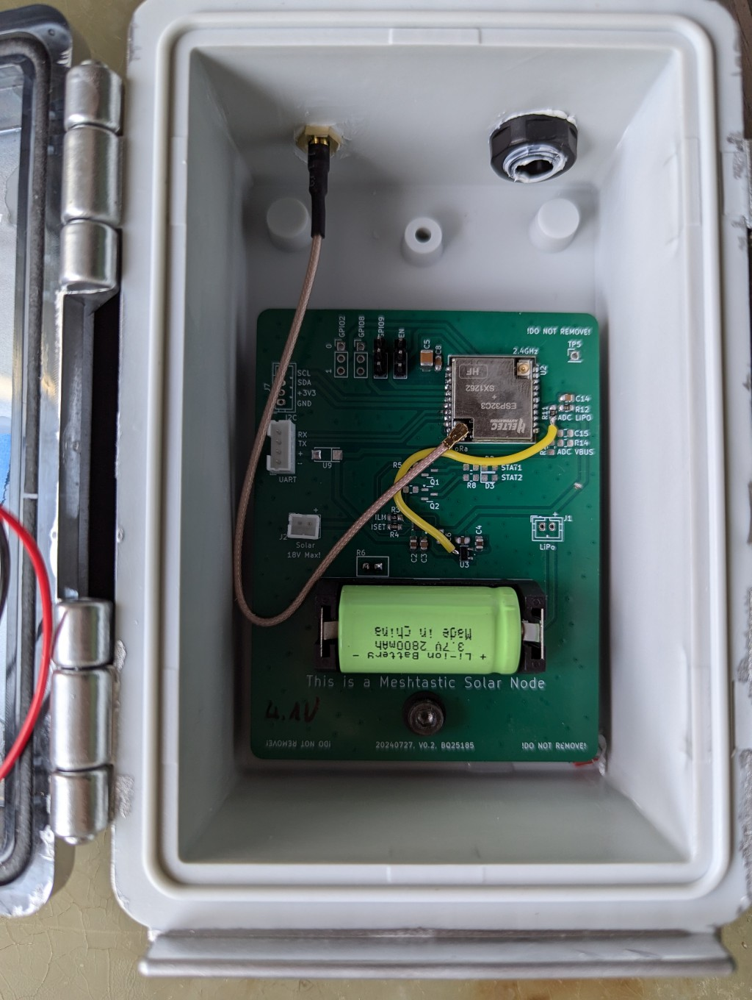
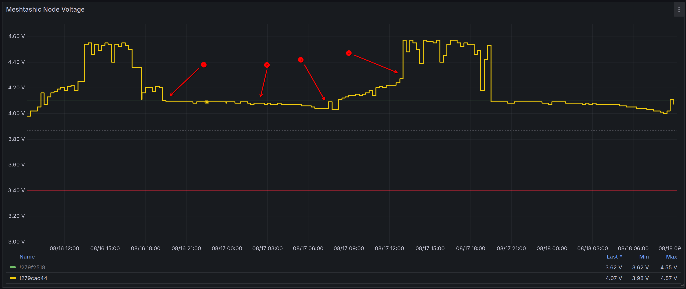

# Test of a Heltec HT-CT62 / TI BQ25185 based Meshtastic node

## Case

Lessons learned: 

  - Use 5-6mm spacers between the solar panel and the box. It indirectly can act as a sunshield. As solar panels are mostly black they heat up a lot and so shouldn't be directly attached to it.
  - White or silver spray reduces the temperature even more. Bonus if it's a highly reflective spray.
  - Gore venting plugs are very expensive but useful to control the humidity. Not overly  critical as long it's only normal water - but salty air like close to the ocean kills electronics.
  - Never use any hot glue. I switched to polymer adhesives used for boats and pools. A slight residual elasticity is desirable as it prevents breakage due to cable movement.

## Electronics

Lessons learned:

 - Voltage dividers with 1M:1M and a 100nF puffer C works perfectly fine. The power drain is below the battery self discharge level and the ESP32 ADC is able to sample the voltage without getting too much noise.

 - The crappy ESP32 ADC isn't super precise. Known issue.

 - For now the TI BQ25185 seems to be the right decision
   - Being able to 18V panels gives a lot of margin for bad weather
   - The end-of-charge voltage can be reduced in several steps to extend the battery life
   - Power path'ing switches the battery off if sunlight is enough to power the device. It's also able to mix both sources.
   - Pseudo MPPT (VINDPM) always gets us the maximum amount of current out of the solar panel
   - CR123a LiPos seem to be a nice trade-off between size and stored power. Also there are cheap variants with integration protection circuits.

- The ESP32C3 can be thamed in terms of current consumption. But let's be honest: it's not a Nordic or STM32U0.
  - Stay in light sleep as much as possible (theoretically ~600-800uA) and wake up by interrupts
  - Avoid BLE or Wifi at all costs

 ## Measurements

For a real world test I setup following hardware configuration:

 - ISET = 300Ohm: Solar current of 1A 
 - ILM = 100kOhm: Maximum charging voltage 4.1V@1100mA
 - Fully charged 2800mAh battery
 - 6V 290mAh solar cell

 Meshtastic configuration:

  - Minimum Wake Interface: 1s (default: 10s)
  - Repeater Mode activated
  - BLE/Wifi disabled (configuration via UART)

 Syytem configuration:
  - ESP32C3 CPU speed reduced to 80MHz

The telemetry values are getting pulled from the device every 30 minutes and then getting stored into an InfluxDB which are getting visualized using Grafana.

Our Meshtastic network (Stuttgart/Germany) has around 22-50 users.

Description

1. Sun gone. The power path circuit disables direct powering from the solar cell. 
2. Discharge process over night
3. First sunlight. Battery charging starts.
4. Battery full. Power Path circuit disables the battery and switches to direct pass-through.

Using that graph the maximum survival time of the device without sunlight an be calculated.

- Start voltage, night: 4.1V

- Stop voltage, early morning: 4.04V

- Assumed hard switch-off voltage: 3.4V

- Duration: 12h

This leads to an average remaining battery run time of theoretically 128h (5.3 days). Pratically this would be more around 3-4 full days.
