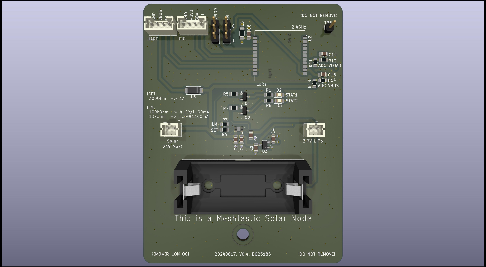

## What is this thing?

This is a Meshtastic solar node based on the [Heltec HT-CT62](https://resource.heltec.cn/download/HT-CT62/HT-CT62(Rev1.1).pdf) and the (new) linear solar charge controller [TI BQ25185](https://www.ti.com/lit/ds/symlink/bq25185.pdf).

Features of this PCB

 - Solar Input up to 18V (24V survival)
 - 3A maximum load
 - 1A maximum charge current
 - Pseudo-MPPT (VINDPM)
 - Power Path (= if the battery is fully charged and there's enough solar power the device is getting powered directly from solar)
 - Two ADC signals for getting VLOAD and  VBUS voltage using voltage dividers
 - 3.7V LiPo either via 18650 block or JST-PH 2.0 connector
 - Low power LDO [HEERMICR HE9073A30MR](https://www.lcsc.com/datasheet/lcsc_datasheet_2304140030_HEERMICR-HE9073A30MR_C723792.pdf)

Combined with a solar panel this device can be placed in remote areas to cover a wide range.

# Where can I get all the stuff?

Heltec HT-CT62: Aliexpress

TI BQ25185: Mouser or Digikey

PCB: You can load the Kicad project file and then export the manufacturing files using the plugins. Just throw them into JLCPCB and order them.

Everything else can be ordered from LCSC.

Due to strict legislation, it is not planned to offer ready-made circuit boards or kits here. Sorry.

# Meshtastic, ESP32 and Power Saving. How?

Warning 1: By enabling "Power Saving" you will loose *all* telemetry (Sensors, Battery Voltages, etc.)!

Warning 2: You also will not be able to configure it by serial port anymore! You have a short period after power cycling it. Use the "meshtastic" Python script as it waits for a while.

### Router Role

1. Enable "Power Saving" (is activated by default if using Router role)

2. When configuring the device you should set the "Minimum Wake Interval" from 10 seconds to 1 second.

3. Switch Bluetooth and Wifi off! They suck power like crazy.

### Client Role

This is more tricky as per default it doesn't switch into "Light Sleep" as several delays are blocking it.

You also have to decrease "Wait Bluetooth Seconds" and "Screen on Seconds" to 1 second.

Then configure is like a "Router".

# Do I have to modify the Software and configuration?

No. Only some smaller changes regarding the pin mapping is required.

```
diff --git a/variants/heltec_esp32c3/variant.h b/variants/heltec_esp32c3/variant.h
index ca00c43f..4f13248f 100644
--- a/variants/heltec_esp32c3/variant.h
+++ b/variants/heltec_esp32c3/variant.h
@@ -1,16 +1,13 @@
-#define BUTTON_PIN 9
-
-// LED pin on HT-DEV-ESP_V2 and HT-DEV-ESP_V3
-// https://resource.heltec.cn/download/HT-CT62/HT-CT62_Reference_Design.pdf
-// https://resource.heltec.cn/download/HT-DEV-ESP/HT-DEV-ESP_V3_Sch.pdf
-#define LED_PIN 2      // LED
-#define LED_STATE_ON 1 // State when LED is lit
-
 #define HAS_SCREEN 0
 #define HAS_GPS 0
 #undef GPS_RX_PIN
 #undef GPS_TX_PIN
 
+#define BATTERY_PIN 1
+#define ADC_CHANNEL ADC1_GPIO1_CHANNEL
+#define ADC_MULTIPLIER 2
+#define BATTERY_SENSE_SAMPLES 5
+
 #define USE_SX1262
 #define LORA_SCK 10
 #define LORA_MISO 6

diff --git a/variants/heltec_esp32c3/pins_arduino.h b/variants/heltec_esp32c3/pins_arduino.h
index a717a370..b8ebc09c 100644
--- a/variants/heltec_esp32c3/pins_arduino.h
+++ b/variants/heltec_esp32c3/pins_arduino.h
@@ -6,8 +6,8 @@
 static const uint8_t TX = 21;
 static const uint8_t RX = 20;
 
-static const uint8_t SDA = 1;
-static const uint8_t SCL = 0;
+static const uint8_t SDA = 18;
+static const uint8_t SCL = 19;
 
 static const uint8_t SS = 8;
 static const uint8_t MOSI = 7;

diff --git a/variants/heltec_esp32c3/platformio.ini b/variants/heltec_esp32c3/platformio.ini
index 6fe5c3c6..8087aa08 100644
--- a/variants/heltec_esp32c3/platformio.ini
+++ b/variants/heltec_esp32c3/platformio.ini
@@ -8,4 +8,6 @@ build_flags =
 monitor_speed = 115200
 upload_protocol = esptool
 ;upload_port = /dev/ttyUSB0
-upload_speed = 921600
\ No newline at end of file
+upload_speed = 921600
+board_build.f_cpu = 80000000L
```

# Evaluation

[Evaluation, PCB v0.2 (CR123A)](./EVALUATION-v02.md)

# FAQ

*The HT-CT62 uses a ESP32C3. Thats not Low Power!!!*

Meshtastic  supports the "Power Saving" mode on the ESP32 where the entire   device stays  in the light sleep mode until it gets a interrupt signal from the LoRa modem. In that phase CPU will consume around ~800uA while sleeping. Including LoRa RX that's a idle draw around 2-4mA.

Still far away from the RAK4631 with a Nordic microcontroller. But who cares? During the day you will have a positive power budget so the entire devices runs on solar energy and recharges its battery. 

*It's not really that cheap either!*

Yep. It's expensive if you build only 1 device. But the costs dramatically drop if think of building 5-10 of them as you can mass order everything (PCBs, Components from LCSC and so own).

*The TI BQ25185 uses a linear regulator to create the voltage before the LDO. That will be inefficient for solar panels above 6V.*

Yes. It's very inefficient if it's running with the power path enabled (= direct solar pass-through) as the device has to burn off a lot of voltage from the panel. During battery runtime the difference is way lower which is acceptable.

It maybe cause unneccesary heat during the winter time where small 18V solar panels would be a great benefit. But for 6V panels it's a within acceptable ranges.

There are other variants (TI BQ25620/BQ25622) that are using a Buck converter.

# Warning

LED circuit for STAT1 and STAT2 not yet tested. The TI BQ25185 uses 1.8V there so we need a transistor as switch.

# License

GPL v3
