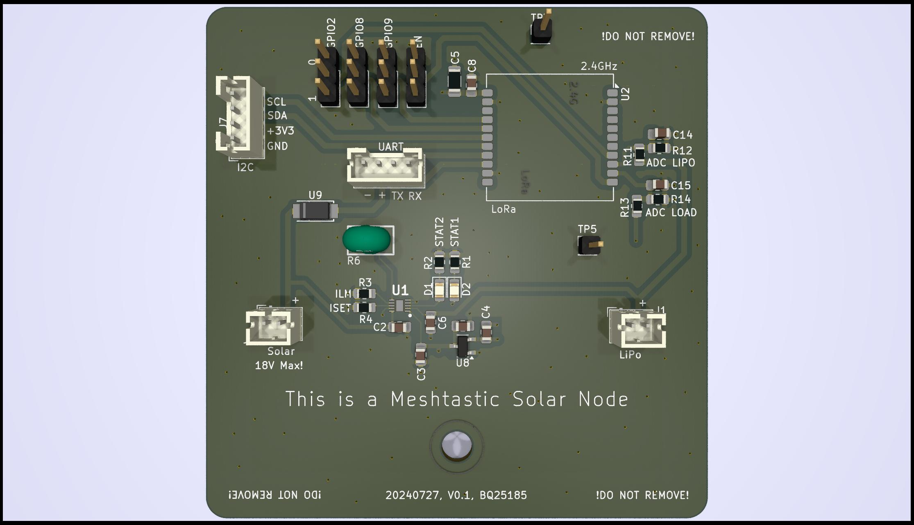

## What is this thing?

This is a Meshtastic solar node based on the Heltec HT-CT62 and the solar charge controller TI BQ25185.

Features of the BQ25185:

 - Solar Input up to 18V
 - ~3A maximum for VLOAD
 - ~1A maximum from VBUS (solar)
 - Power Path (= disables the battery if solar energy provides enough power)
 - MPPT

PCB not yet tested. This will follow.
