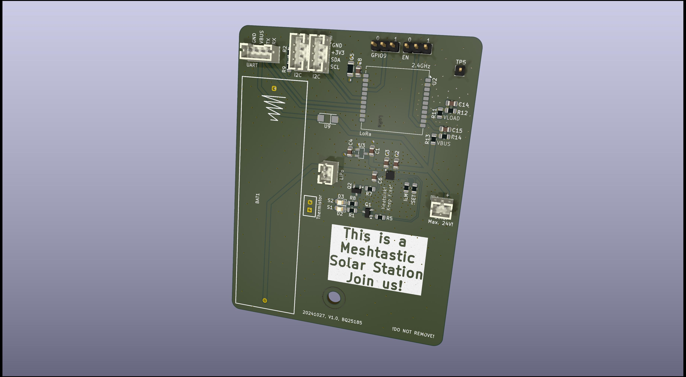

## What is this thing?

This is a Meshtastic solar node based on the [Heltec HT-CT62](https://resource.heltec.cn/download/HT-CT62/HT-CT62(Rev1.1).pdf) and the (new) solar charge controller [TI BQ25185](https://duckduckgo.com).

Features of this PCB

 - Solar Input up to 18V (24V survival)
 - 3A maximum load
 - 1A maximum charge current
 - Power Path (= if the battery is fully charged and there's enough solar power the device is getting powered directly from solar)
 - Pseudo-MPPT (VINDPM)
 - Two ADC pins to get battery (GPIO1) and solar (GPIO0) voltage using voltage dividers
 - Battery either with a  CR123A or JST-PH 3.7V LiPo
 - Low power LDO [HEERMICR HE9073A33MR](https://www.lcsc.com/datasheet/lcsc_datasheet_2201242130_HEERMICR-HE9073A33MR_C723793.pdf)

Combined with a solar panel this device can be placed in remote areas to cover a wide range.

# Do I have to modify the Software and configuration?

No. Only some smaller changes regarding the pin mapping is required.

```
diff --git a/variants/heltec_esp32c3/pins_arduino.h b/variants/heltec_esp32c3/pins_arduino.h
index a717a370..b8ebc09c 100644
--- a/variants/heltec_esp32c3/pins_arduino.h
+++ b/variants/heltec_esp32c3/pins_arduino.h
@@ -6,8 +6,8 @@
 static const uint8_t TX = 21;
 static const uint8_t RX = 20;
 
-static const uint8_t SDA = 1;
-static const uint8_t SCL = 0;
+static const uint8_t SDA = 18;
+static const uint8_t SCL = 19;
 
 static const uint8_t SS = 8;
 static const uint8_t MOSI = 7;
diff --git a/variants/heltec_esp32c3/variant.h b/variants/heltec_esp32c3/variant.h
index 360d9bf1..4f66476d 100644
--- a/variants/heltec_esp32c3/variant.h
+++ b/variants/heltec_esp32c3/variant.h
@@ -1,16 +1,11 @@
-#define BUTTON_PIN 9

-#define LED_PIN 2 // LED
-#define LED_INVERTED 0

 #define HAS_SCREEN 0
 #define HAS_GPS 0
 #undef GPS_RX_PIN
 #undef GPS_TX_PIN
 
+#define BATTERY_PIN 1
+#define ADC_CHANNEL ADC1_GPIO1_CHANNEL
+#define ADC_MULTIPLIER 2 * 1.015
+#define BATTERY_SENSE_SAMPLES 30
+
 #define USE_SX1262
 #define LORA_SCK 10
 #define LORA_MISO 6
```

When configuring the device you should set the "Minimum Wake Interval" from 10 seconds to 1 second.

Switch  Bluetooth and Wifi off! They suck power like crazy.


# Evaluation

[Real World Evaluation of the device](./EVALUATION.md)

# FAQ

*The HT-CT62 uses a ESP32C3. Thats not Low Power!!!*

Meshtastic  supports the "Power Saving" mode on the ESP32 where the entire   device stays  in the light sleep mode until it gets a interrupt signal from the LoRa modem. In that phase CPU will consume around ~800uA while sleeping. Including LoRa RX that's a idle draw around 2-4mA.

Still far away from the Wisblock. But who cares? During the day you will have a positive power budget so the entire devices runs on solar energy and recharges its battery. 

*It's not really that cheap either!*

Yep. It's expensive if you build only 1 device. But the costs dramatically drop if think of building 5-10 of them as you can mass order everything (PCBs, Components from LCSC and so own).


# Warning

LED circuit for STAT1 and STAT2 not yet tested. The TI BQ25185 uses 1.8V there so we need a transistor as switch.

# License

GPL v3
